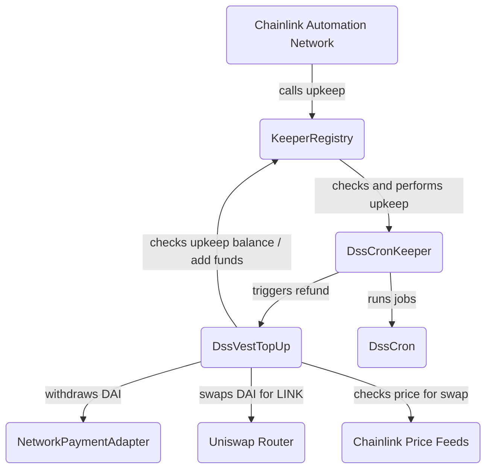

# Chainlink Automation Contracts for MakerDAO

[MIP63: Maker Keeper Network](https://forum.makerdao.com/t/mip63-maker-keeper-network/12091) implementation for the [Chainlink Automation Network](https://automation.chain.link).

Maintains Maker protocol by poking oracles, liquidating vaults, managing the autoline, managing D3Ms, etc.

#### Main Contracts

- [`DssCronKeeper.sol`](/contracts/DssCronKeeper.sol)
  - Executes pending jobs from the [Sequencer](https://github.com/makerdao/dss-cron/)
  - Triggers upkeep refunding when needed by calling `DssVestTopUp`
  - Registered as upkeep
- [`DssVestTopUp.sol`](/contracts/DssVestTopUp.sol)
  - Withdraws accumulated DAI from the [Vest](https://github.com/makerdao/dss-vest/)
  - Swaps DAI for LINK via Uniswap
  - Transfers swapped LINK to the upkeep balance

#### Architecture Overview



## Setup

Clone the repo and install all dependencies.

```bash
git clone git@github.com:hackbg/chainlink-makerdao-automation.git
cd chainlink-makerdao-automation

git submodule init
git submodule update

npm install
```

## Configuration

Copy the `.env.example` to `.env` file and make sure you've set all of the following.

1. Hardhat development environment

| Name                | Description                                   |
| ------------------- | --------------------------------------------- |
| `RPC_URL`           | URL of a node                                 |
| `PRIVATE_KEY`       | Controls which account Hardhat uses           |
| `ETHERSCAN_API_KEY` | Required to verify contract code on Etherscan |

2. `DssCronKeeper` contract

| Name           | Description                                      |
| -------------- | ------------------------------------------------ |
| `SEQUENCER`    | Address of `Sequencer`                           |
| `NETWORK_NAME` | Short name from the `Sequencer` network registry |

3. `DssVestTopUp` contract

| Name                      | Description                                                                                                                                                                                         |
| ------------------------- | --------------------------------------------------------------------------------------------------------------------------------------------------------------------------------------------------- |
| `UPKEEP_ID`               | Unique identifier of the registered upkeep for `DssCronKeeper`                                                                                                                                      |
| `KEEPER_REGISTRY_V2`      | Address of `KeeperRegistry` V2                                                                                                                                                                      |
| `DAI_TOKEN`               | Address of DAI token                                                                                                                                                                                |
| `LINK_TOKEN`              | Address of LINK token                                                                                                                                                                               |
| `NETWORK_PAYMENT_ADAPTER` | Address of `NetworkPaymentAdapter` for the keeper network                                                                                                                                           |
| `DAI_USD_PRICE_FEED`      | Chainlink price feed for the DAI / USD pair                                                                                                                                                         |
| `LINK_USD_PRICE_FEED`     | Chainlink price feed for the LINK / USD pair                                                                                                                                                        |
| `SWAP_ROUTER_V3`          | Address of Uniswap V3 Router                                                                                                                                                                        |
| `SLIPPAGE_TOLERANCE_BPS`  | Price slippage tolerance in basis points. Learn more [here](https://support.uniswap.org/hc/en-us/articles/8643879653261-What-is-Price-Slippage-).                                                   |
| `UNISWAP_PATH`            | Uniswap V3 path for swapping DAI for LINK. Example: `DAI, 500, WETH, 3000, LINK`. Learn more [here](https://docs.uniswap.org/contracts/v3/guides/swaps/multihop-swaps#exact-input-multi-hop-swaps). |

4. End-to-end test environment (currently running on a fork of Goerli testnet until the mainnet deployment of `KeeperRegistryV2`)

| Name                                   | Description                                                         |
| -------------------------------------- | ------------------------------------------------------------------- |
| `STAGING_SWAP_ROUTER`                  | Address of Uniswap V3 Router                                        |
| `STAGING_LINK_TOKEN`                   | Address of LINK token                                               |
| `STAGING_PAYMENT_USD_PRICE_FEED`       | Chainlink price feed for the DAI / USD pair                         |
| `STAGING_LINK_USD_PRICE_FEED`          | Chainlink price feed for the LINK / USD pair                        |
| `STAGING_UNISWAP_V3_FACTORY`           | Uniswap V3 Factory address                                          |
| `STAGING_NONFUNGIBLE_POSITION_MANAGER` | Uniswap V3 Nonfungible Position Manager address                     |
| `STAGING_KEEPER_REGISTRY_LOGIC`        | Address of `KeeperRegistryLogic` used to deploy `KeeperRegistry2_0` |
| `STAGING_VOW`                          | Address of `Vow`                                                    |

Note: All example addresses are the actual values for Ethereum Mainnet and the staging ones for Goerli testnet.

## Test

Run unit tests on the local Hardhat network.

```bash
npm test
```

For end-to-end testing.

```bash
npm run test:e2e
```

## Deploy

1. Run the following to deploy `DssVestCronKeeper.sol` to a network configured in Hardhat config.

```bash
npx hardhat run scripts/deploy_keeper.ts --network <network>
```

Note: After successful deployment, the contract must be [registered as new upkeep](https://docs.chain.link/chainlink-automation/register-upkeep/) to start performing pending jobs.

2. Then deploy `DssVestTopUp.sol` by running the following.

```bash
npx hardhat run scripts/deploy_topup.ts --network <network>
```

3. Finally, to enable auto refunding of the `DssCronKeeper` upkeep, call `setUpkeepRefunder(address)` and pass the address of the deployed `DssVestTopUp` contract.

## References

- [MakerDAO](https://makerdao.com/en/)
- [Chainlink Automation Docs](https://docs.chain.link/chainlink-automation/introduction/)
