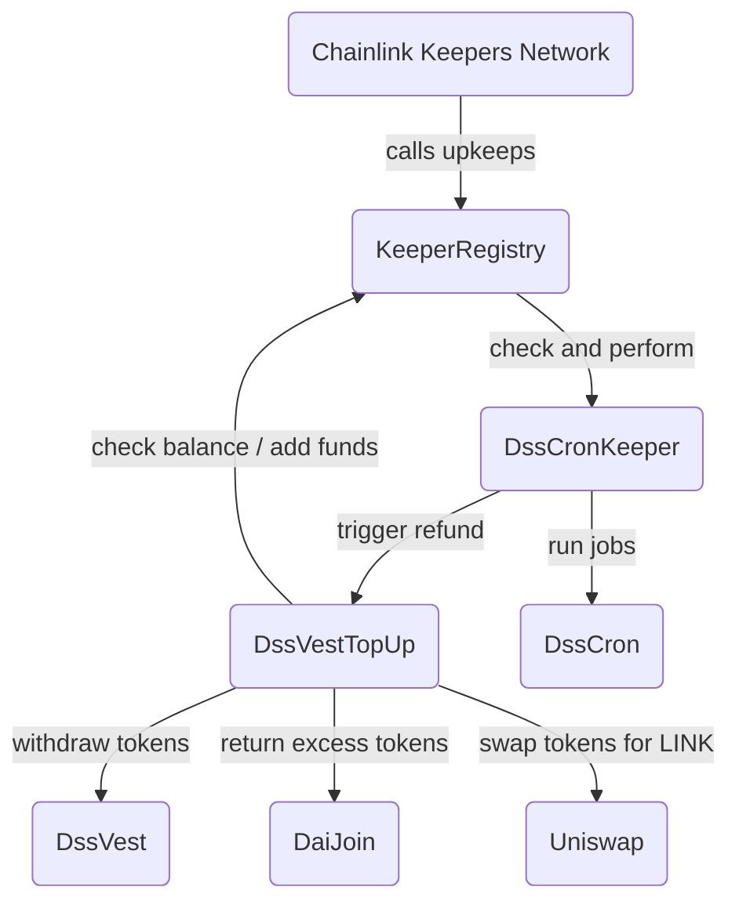

# Chainlink Keepers Contracts for MakerDAO

[Chainlink Keepers](https://docs.chain.link/docs/chainlink-keepers/introduction) implementation for [MIP63: Maker Keeper Network](https://forum.makerdao.com/t/mip63-maker-keeper-network/12091).

Maintains Maker protocol by poking oracles, liquidating vaults, managing the autoline, managing D3Ms, etc.

#### Main Contracts

- [`DssCronKeeper.sol`](/contracts/DssCronKeeper.sol)
  - Executes pending jobs from [MakerDAO Sequencer](https://github.com/makerdao/dss-cron/)
  - Triggers upkeep refunding when needed by calling the topup contract
  - Chainlink Keepers Compatible
- [`DssVestTopUp.sol`](/contracts/DssVestTopUp.sol)
  - Checks whether upkeep refund is viable
  - Refunds upkeep by
    - Withdrawing accrued tokens from [MakerDAO Vest](https://github.com/makerdao/dss-vest)
    - Using transferred tokens in case of emergency
    - Swapping tokens for LINK

#### Architecture Overview



## Setup

Clone the repo and install all dependencies:

```bash
git clone git@github.com:hackbg/chainlink-makerdao-keepers.git
cd chainlink-makerdao-keepers

git submodule init
git submodule update

npm install
```

## Configuration

Copy the `.env.example` to `.env` file and make sure you've set all of the following:

1. Hardhat related

| Name                | Description                                   |
| ------------------- | --------------------------------------------- |
| `RPC_URL`           | URL of a node                                 |
| `PRIVATE_KEY`       | Controls which account Hardhat uses           |
| `ETHERSCAN_API_KEY` | Required to verify contract code on Etherscan |

2. Production environment

| Name                     | Description                                                                                                                                                                                        |
| ------------------------ | -------------------------------------------------------------------------------------------------------------------------------------------------------------------------------------------------- |
| `SEQUENCER`              | Address of [Sequencer](https://github.com/makerdao/dss-cron/)                                                                                                                                      |
| `NETWORK_NAME`           | Short name from the Sequencer network registry                                                                                                                                                     |
| `DSS_VEST`               | Address of [DssVest](https://github.com/makerdao/dss-vest)                                                                                                                                         |
| `DAI_JOIN`               | Address of [DaiJoin](https://docs.makerdao.com/smart-contract-modules/collateral-module/join-detailed-documentation#3-key-mechanisms-and-concepts)                                                 |
| `VOW`                    | Address of [Vow](https://docs.makerdao.com/smart-contract-modules/system-stabilizer-module/vow-detailed-documentation)                                                                             |
| `PAYMENT_TOKEN`          | Address of ERC-20 token used for payment in DssVest, like DAI                                                                                                                                      |
| `KEEPER_REGISTRY`        | Address of KeeperRegistry                                                                                                                                                                          |
| `SWAP_ROUTER`            | Address of Uniswap V3 Router                                                                                                                                                                       |
| `LINK_TOKEN`             | Address of ERC-20 token used for payment in KeeperRegistry                                                                                                                              |
| `PAYMENT_USD_PRICE_FEED` | Chainlink price feed for the DAI / USD pair or the associated `PAYMENT_TOKEN` and USD                                                                                                              |
| `LINK_USD_PRICE_FEED`    | Chainlink price feed for the LINK / USD pair                                                                                                                                                       |
| `MIN_WITHDRAW_AMOUNT`       | Minimum amount of `PAYMENT_TOKOEN` required to trigger top up                                                                                                                                      |
| `MAX_DEPOSIT_AMOUNT`        | Maximum amount of `PAYMENT_TOKOEN` allowed to fund an upkeep. The excess amount is returned to the [Surplus Buffer](https://manual.makerdao.com/parameter-index/core/param-system-surplus-buffer). |
| `BALANCE_THRESHOLD`      | Upkeep LINK balance threshold                                                                                                                                                                      |

3. Staging environment

| Name                             | Description                                                                                                                                                                               |
| -------------------------------- | ----------------------------------------------------------------------------------------------------------------------------------------------------------------------------------------- |
| `STAGING_SWAP_ROUTER`            | Address of Uniswap V3 Router on testnet                                                                                                                                                   |
| `STAGING_LINK_TOKEN`             | Address of ERC-20 token like LINK on testnet                                                                                                                                              |
| `STAGING_PAYMENT_USD_PRICE_FEED` | Chainlink price feed for the DAI / USD pair on testnet                                                                                                                                    |
| `STAGING_LINK_USD_PRICE_FEED`    | Chainlink price feed for the LINK / USD pair on testnet                                                                                                                                   |
| `STAGING_UNISWAP_V3_FACTORY`     | Uniswap V3 Factory address                                                                                                                                   |
| `NONFUNGIBLE_POSITION_MANAGER`    | NonFungible Position Manager

Note: All example values are the actual values for Ethereum Mainnet and the staging ones for Goerli testnet.

## Test

Run unit tests on the local Hardhat network:

```bash
npm test
```

For end-to-end testing:

```bash
npm run test:e2e
```

## Deploy

1. Run the following to deploy `DssVestCronKeeper.sol` to a network configured in Hardhat config:

```bash
npx hardhat run scripts/deploy_keeper.ts --network <network>
```

- After successful deployment, the contract must be [registered as new Upkeep](https://docs.chain.link/docs/chainlink-keepers/register-upkeep/) to start performing pending jobs

2. Then deploy `DssVestTopUp.sol`:

```bash
npx hardhat run scripts/deploy_topup.ts --network <network>
```

- The deployed contract must be initialized with `vestId` and `upkeepId` by calling the respective setter functions
  - To acquire `vestId`, a new application must be [submitted to MakerDAO](https://forum.makerdao.com/t/mip63-maker-keeper-network/12091)
  - The `upkeepId` is available after registering a new Upkeep

3. Finally, to enable auto refunding of the `DssCronKeeper` upkeep, call `setUpkeepRefunder(address)` and pass the address of the deployed `DssVestTopUp`

Note: all setter functions must be called from the contract owner account, which is the deployer account if not changed afterwards.

## References

- [MakerDAO](https://makerdao.com/en/)
- [Chainlink Keepers Docs](https://docs.chain.link/docs/chainlink-keepers/introduction/)
