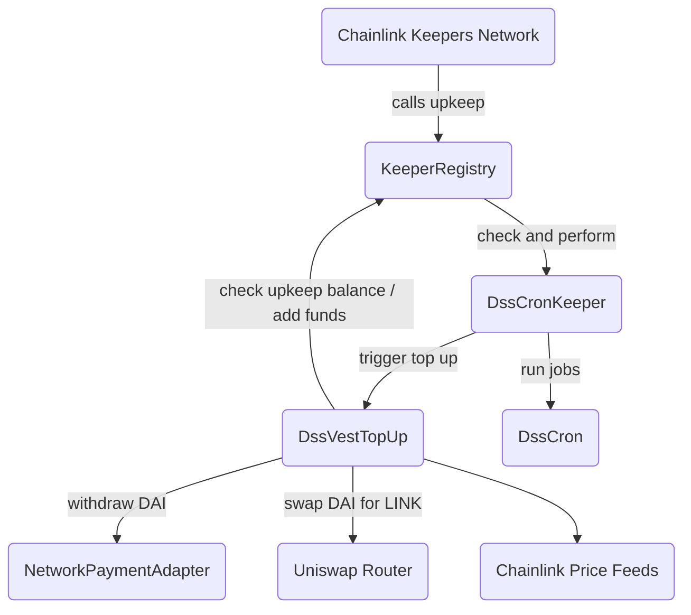

# Chainlink Keepers Contracts for MakerDAO

[Chainlink Keepers](https://docs.chain.link/docs/chainlink-keepers/introduction) implementation for [MIP63: Maker Keeper Network](https://forum.makerdao.com/t/mip63-maker-keeper-network/12091).

Maintains Maker protocol by poking oracles, liquidating vaults, managing the autoline, managing D3Ms, etc.

#### Main Contracts

- [`DssCronKeeper.sol`](/contracts/DssCronKeeper.sol)
  - Executes pending jobs from [MakerDAO Sequencer](https://github.com/makerdao/dss-cron/)
  - Triggers upkeep refunding when needed by calling `DssVestTopUp`
  - Compatible with Chainlink Automation
- [`DssVestTopUp.sol`](/contracts/DssVestTopUp.sol)
  - Checks whether upkeep refund is viable
  - Refunds upkeep by
    - Withdrawing vested DAI via `NetworkPaymentAdapter` interface
    - Swapping DAI for LINK and transfers to `KeeperRegistry`

#### Architecture Overview



## Setup

Clone the repo and install all dependencies:

```bash
git clone git@github.com:hackbg/chainlink-makerdao-keepers.git
cd chainlink-makerdao-keepers

git submodule init
git submodule update

npm install
```

## Configuration

Copy the `.env.example` to `.env` file and make sure you've set all of the following:

1. Hardhat development environment

| Name                | Description                                   |
| ------------------- | --------------------------------------------- |
| `RPC_URL`           | URL of a node                                 |
| `PRIVATE_KEY`       | Controls which account Hardhat uses           |
| `ETHERSCAN_API_KEY` | Required to verify contract code on Etherscan |

2. `DssCronKeeper`

| Name           | Description                                                   |
| -------------- | ------------------------------------------------------------- |
| `SEQUENCER`    | Address of [Sequencer](https://github.com/makerdao/dss-cron/) |
| `NETWORK_NAME` | Short name from the Sequencer network registry                |

3. `DssVestTopUp`

| Name                         | Description                                                                                                                |
| ---------------------------- | -------------------------------------------------------------------------------------------------------------------------- |
| `UPKEEP_ID`                  | Unique identifier of the registered upkeep for `DssCronKeeper`                                                             |
| `KEEPER_REGISTRY_V2`         | Address of `KeeperRegistry` v2                                                                                             |
| `DAI_TOKEN`                  | Address of `DAI` token                                                                                                     |
| `LINK_TOKEN`                 | Address of `LINK` token                                                                                                    |
| `DAI_USD_PRICE_FEED`         | Chainlink price feed for the `DAI / USD` pair                                                                              |
| `LINK_USD_PRICE_FEED`        | Chainlink price feed for the `LINK / USD` pair                                                                             |
| `SWAP_ROUTER_V3`             | Address of Uniswap V3 Router                                                                                               |
| `UNISWAP_POOL_FEE`           | Uniswap pool [fee tier](https://docs.uniswap.org/concepts/protocol/fees#pool-fees-tiers)                                   |
| `SLIPPAGE_TOLERANCE_PERCENT` | [Price slippage](https://support.uniswap.org/hc/en-us/articles/8643879653261-What-is-Price-Slippage-) tolerance percentage |

4. Staging environment (Testnet)

| Name                             | Description                                             |
| -------------------------------- | ------------------------------------------------------- |
| `STAGING_SWAP_ROUTER`            | Address of Uniswap V3 Router on testnet                 |
| `STAGING_LINK_TOKEN`             | Address of ERC-20 token like LINK on testnet            |
| `STAGING_PAYMENT_USD_PRICE_FEED` | Chainlink price feed for the DAI / USD pair on testnet  |
| `STAGING_LINK_USD_PRICE_FEED`    | Chainlink price feed for the LINK / USD pair on testnet |
| `STAGING_UNISWAP_V3_FACTORY`     | Uniswap V3 Factory address                              |
| `NONFUNGIBLE_POSITION_MANAGER`   | NonFungible Position Manager                            |

Note: All example values are the actual values for Ethereum Mainnet and the staging ones for Goerli testnet.

## Test

Run unit tests on the local Hardhat network:

```bash
npm test
```

For end-to-end testing:

```bash
npm run test:e2e
```

## Deploy

1. Run the following to deploy `DssVestCronKeeper.sol` to a network configured in Hardhat config:

```bash
npx hardhat run scripts/deploy_keeper.ts --network <network>
```

Note: After successful deployment, the contract must be [registered as new Upkeep](https://docs.chain.link/chainlink-automation/register-upkeep/) to start performing pending jobs.

2. Then deploy `DssVestTopUp.sol`:

```bash
npx hardhat run scripts/deploy_topup.ts --network <network>
```

The deployed contract must be initialized with `NetworkPaymentAdapter` address by calling `setPaymentAdapter` from the contract owner account.

3. Finally, to enable auto refunding of the `DssCronKeeper` upkeep, call `setUpkeepRefunder(address)` and pass the address of the deployed `DssVestTopUp` contract.

## References

- [MakerDAO](https://makerdao.com/en/)
- [Chainlink Automation Docs](https://docs.chain.link/chainlink-automation/introduction/)
